# Energy Compliance Intelligence Platform

CDC-driven pipeline tracking German industrial electricity subsidy entitlement and decarbonization investment obligations under the 2026 CISAF framework. Simulates 8 industrial facilities across a full modern data stack: Debezium · Redpanda Cloud · kafka-python bridge · PySpark · Delta Lake · dbt · Airflow · ChromaDB.

---

## Problem Statement

Germany's Clean Industrial Deal State Aid Framework (CISAF), effective January 1, 2026, entitles eligible industrial companies to 50% of annual electricity consumption at a subsidized target price of 5 euro cents per kWh, against a market price of approximately 14 cents per kWh. Companies must reinvest at least 50% of the subsidy received into qualifying decarbonization projects within 48 months, or repay the full subsidy plus interest.

This creates three live data problems:

1. Meter readings arrive from multiple sources and are corrected retroactively. A compliance system that snapshots at midnight misses intraday corrections that affect subsidy calculations.
2. Wholesale market prices (sourced from SMARD) update hourly. Subsidy entitlement is calculated against these prices continuously.
3. Investment records live in ERP systems and change as invoices are revised. Compliance officers need point-in-time audit accuracy, not just the current state.

This platform automates detection, calculation, and natural language querying of all three.

---

## Architecture

```
PostgreSQL (simulated ERP/meter system)
        |
   Debezium CDC (pgoutput, WAL-based)
        |
  Local Kafka (single broker, Docker)
        |
  kafka-python bridge script
        |
  Redpanda Cloud (Serverless, eu-central-1)
        |
  PySpark (local WSL) ---------> Delta Lake
        |                         Bronze / Silver
        |
  databricks-sql-connector
        |
  Databricks SQL Warehouse
  (Unity Catalog: workspace.energy_compliance)
        |
       dbt (Gold layer, 8 models)
        |
     Airflow (orchestration, 2 DAGs)
        |
  ChromaDB RAG (NLI hallucination gate)
```

SMARD API feeds real German wholesale electricity prices on a weekly schedule via the `smard_price_dag` Airflow DAG.

---

## What Ran

### Phase 1 — CDC Pipeline

| Component | Detail |
|---|---|
| Source tables | facilities (8 rows), meter_readings, investments |
| Debezium connector | energy-postgres-connector, pgoutput plugin, slot: energy_debezium_slot |
| Local Kafka topics | energy.public.facilities, energy.public.meter_readings, energy.public.investments |
| Bridge script | kafka_to_redpanda.py, TOPIC_MAP translates to cisaf.* naming |
| Redpanda Cloud topics | cisaf.facilities (8), cisaf.meter_readings (16,089), cisaf.investments (484) |

**Key detail:** MirrorMaker2 was abandoned after `connect-mirror-maker` ran both replication directions regardless of `enabled=false`. The kafka-python bridge is a deliberate simplification documented as an architectural trade-off.

**Root cause documented:** SASL bleed from leftover `CONNECT_ADMIN_SASL_MECHANISM` env vars caused TLS ClientHello to reach the PLAINTEXT local broker. Kafka logged `InvalidReceiveException` with size `0x16030100` (TLS header bytes). Fix: remove all SASL env vars, clean Dockerfile, remove `docker_kafka_data` volume, recreate containers.

### Phase 2 — Bronze and Silver (Delta Lake on WSL)

| Layer | Table | Row Count | Notes |
|---|---|---|---|
| Bronze | meter_readings_bronze | 16,089 | Raw CDC events, append-only |
| Bronze | investments_bronze | 484 | Raw CDC events, append-only |
| Silver | silver_meter_readings | 16,089 | 15,328 current + 761 historical |
| Silver | silver_investments | 484 | 451 current + 33 historical |

Correction rate: 5.0% on meter readings (761 historical records out of 16,089 total).

**Debezium field encodings resolved:**
- `reported_kwh`: base64 Kafka Connect Decimal, scale=3. Decode: base64 → `int.from_bytes(..., signed=True)` → divide by 1000.
- `amount_eur`: base64 Decimal, scale=2. Same pattern, divide by 100.
- `reading_timestamp`: ISO ZonedTimestamp string (`2026-01-30T16:00:00.000000Z`).
- `investment_date`: epoch days integer. Convert via `date(1970,1,1) + timedelta(days=int(days))`.
- `get_json_object` used per field (not `from_json` — schema mismatch caused silent nulls).

SCD Type 2 implemented via Delta Lake MERGE: when a corrected reading arrives, the existing current record is closed (`is_current = false`, `effective_end` set) and a new record is inserted with the corrected value.

### Phase 3 — Gold Layer (dbt on Databricks)

Databricks SQL Warehouse: `dbc-174e65df-4c24.cloud.databricks.com`, HTTP path `/sql/1.0/warehouses/d7ae726d9291a51f`.  
Unity Catalog: `workspace.energy_compliance`.

| Model | Type | Description |
|---|---|---|
| stg_meter_readings | view | Filters to current SCD records |
| stg_investments | view | Filters to current SCD records |
| stg_facilities | view | Subsidy-eligible facilities |
| stg_wholesale_prices | view | SMARD hourly prices |
| fct_monthly_consumption | table | Monthly kWh per facility |
| fct_subsidy_entitlement | table | Entitlement using `GREATEST(market_price - 0.05, 0)` |
| fct_investment_compliance | table | Investment totals vs. required reinvestment |
| facility_compliance_summary | table | Compliance status and risk flags per facility |

All 10 dbt tests passed.

**SMARD wholesale prices (real data):**
- Filter 4169: Marktpreis Deutschland/Luxemburg, day-ahead hourly
- 1,826 records, January–March 2026
- Jan avg: 117.20 EUR/MWh | Feb avg: 96.51 EUR/MWh | Mar avg: 104.89 EUR/MWh
- Overall avg: 106.18 EUR/MWh. Negative prices observed in March.

**Databricks CLI note:** DBFS auth fails with scoped OAuth token regardless of scope setting. Workaround: `databricks-sql-connector` with batch INSERT statements to push Silver tables directly into Unity Catalog.

### Phase 4 — Airflow Orchestration

Airflow 3.1.8, standalone mode (not Docker), `AIRFLOW_HOME=~/energy-compliance-platform/airflow`.

| DAG | Schedule | Tasks |
|---|---|---|
| smard_price_dag | @weekly | Fetch SMARD prices → upload to Databricks |
| data_pipeline_dag | @daily | dbt build → query facility_compliance_summary → log compliance status |

Both DAGs ran green.

**Compliance check output (from Airflow task log, 2026-03-24):**

| Facility | Status | Subsidy (EUR) | Compliance % |
|---|---|---|---|
| Zementwerk Leipzig | AT_RISK | 0.00 | 0.0% |
| Raffinerie Hamburg | COMPLIANT | 15,069,587.63 | 1311.6% |
| Chemiepark Ludwigshafen | COMPLIANT | 8,413,185.28 | 2158.9% |
| Aluminiumwerk Neuss | COMPLIANT | 5,421,172.63 | 2693.3% |
| Stahlwerk Mannheim | COMPLIANT | 5,724,552.72 | 3395.2% |
| Kupferhütte Hamburg | COMPLIANT | 3,909,197.05 | 4554.0% |
| Papierfabrik Augsburg | COMPLIANT | 1,925,472.62 | 6278.5% |
| Glaswerk Würzburg | COMPLIANT | 2,107,515.93 | 10058.5% |

**Airflow 3.x breaking changes encountered:**
- `airflow users` CLI command removed. User creation uses `airflow db` or the web UI.
- `AIRFLOW_HOME` does not persist across WSL sessions without explicit export in `~/.bashrc`.

### Phase 5 — RAG Layer (ChromaDB)

| Component | Detail |
|---|---|
| Vector store | ChromaDB at `rag/chromadb/` |
| Embedding model | `all-MiniLM-L6-v2` (sentence-transformers) |
| Hallucination gate | `cross-encoder/nli-deberta-v3-small`, threshold=2.0 |
| LLM | Groq `llama-3.1-8b-instant` |
| Sources indexed | 3 real public CISAF documents (Gleiss Lutz, United Government Affairs, Pexapark) |
| Chunks | 10 total |

All 3 demo queries passed the NLI gate.

**Demo queries:**

1. "What counts as a qualifying decarbonization investment under CISAF?" — Retrieved from Gleiss Lutz regulatory analysis, answer cites investment categories (renewable energy, storage, efficiency, demand flexibility).

2. "What is the penalty for non-compliance with the reinvestment obligation?" — Retrieved from United Government Affairs policy brief, answer cites full subsidy repayment plus interest.

3. "Which of our facilities are at risk of missing the reinvestment deadline?" — Combines live Databricks query (facility_compliance_summary) with retrieved regulatory context. Correctly identifies Zementwerk Leipzig as the only at-risk facility.

**NLI gate pattern** was reused from a separate news-RAG project Vaishnavi had already built. The gate rejects answers where the NLI entailment score between retrieved context and generated answer falls below threshold=2.0, preventing the LLM from generating plausible-sounding but unsupported regulatory claims.

---

## Engineering Decisions

### Why CDC instead of batch polling

Meter readings are corrected retroactively throughout the day. A full table scan at midnight captures the state at one point in time and misses intermediate corrections. Debezium captures every state change with before/after values and timestamps, which is what feeds SCD Type 2 downstream. The before state is what closes the existing SCD record; the after state is what opens the new one.

### Why SCD Type 2 instead of overwrite

Energy subsidy calculations are subject to regulatory audit. An auditor asking "what did your consumption data show on January 31, 2026?" requires a point-in-time answer. Overwriting the current value destroys that audit trail. SCD Type 2 preserves every correction with its validity period using `effective_start`, `effective_end`, and `is_current` columns.

### Why Delta Lake instead of plain Parquet

Three specific capabilities required here that plain Parquet cannot provide: MERGE for upserts (SCD Type 2 without full table rewrites), time travel for point-in-time audit queries, and schema enforcement to reject malformed CDC events at write time. ACID transactions also prevent partial writes from corrupting the Silver layer during a correction burst.

### Why the kafka-python bridge instead of MirrorMaker2

MirrorMaker2's `connect-mirror-maker` image runs both replication directions regardless of `enabled=false` in config. The `MirrorSourceConnector` via Connect REST API also failed because the producer wrote back to local Kafka, not to Redpanda. The kafka-python bridge is 80 lines, fully observable, and does exactly one thing: consume from local Kafka, produce to Redpanda Cloud. The trade-off (no native offset tracking, no consumer group rebalancing) is documented and acceptable for a single-node simulation.

### Why NLI hallucination gate

LLMs will generate plausible regulatory language even when the retrieved context does not support the claim. For a compliance use case where the answer drives financial decisions, a factually wrong answer is worse than no answer. The NLI gate runs a cross-encoder over the (context, answer) pair and rejects the answer if the entailment score is below threshold. The user sees "low confidence" rather than a confident wrong answer.

### Why split architecture (local PySpark + Databricks)

Databricks Serverless blocks external Kafka connectivity due to VPC restrictions, and Maven JARs are not supported. Bronze and Silver processing runs locally on WSL with PySpark. Gold layer and dbt run on Databricks SQL Warehouse where the compute is appropriate for aggregation queries. This split is the defensible answer: use the right compute for each layer rather than forcing everything onto one platform.

---

## Data Flow Detail

```
PostgreSQL WAL
  → Debezium reads pgoutput slot
  → Publishes to local Kafka (energy.public.meter_readings)
  → kafka_to_redpanda.py consumes, remaps topic name
  → Publishes to Redpanda Cloud (cisaf.meter_readings)
  → PySpark reads from Redpanda (Kafka-compatible API)
  → Bronze: raw event written to Delta Lake (append-only)
  → Silver: MERGE checks if reading_id exists and is_current=true
      if yes and value changed: close old record, insert new
      if no: insert as new current record
  → upload_to_databricks.py pushes Silver tables via sql-connector
  → dbt staging views filter to is_current=true
  → dbt gold models join consumption + SMARD prices + investments
  → facility_compliance_summary: compliance_pct, compliance_status, flexibility_bonus_eligible
  → Airflow data_pipeline_dag queries summary, logs AT_RISK facilities
  → RAG query_rag.py optionally joins live summary with ChromaDB context
```

---

## Airflow DAGs

### smard_price_dag (@weekly)

Fetches SMARD API (filter 4169, hourly, DE), writes to `workspace.energy_compliance.smard_wholesale_prices` via `databricks-sql-connector`. Handles the case where SMARD returns partial data for the current week by filtering to complete days only.

### data_pipeline_dag (@daily)

1. Runs `dbt build` against the Databricks SQL Warehouse.
2. Queries `facility_compliance_summary` for all facilities.
3. Logs compliance status per facility. Raises an Airflow task failure (not just a warning) if any facility has `compliance_status = 'AT_RISK'`, which triggers an Airflow alert.

---

## RAG Layer

ChromaDB stores 10 chunks from 3 real public CISAF sources. At query time:

1. Query is embedded with `all-MiniLM-L6-v2`.
2. Top-3 chunks retrieved by cosine similarity.
3. For Query 3 (facility risk): live SQL result from Databricks is appended to the prompt alongside retrieved chunks.
4. Groq `llama-3.1-8b-instant` generates the answer.
5. NLI gate runs `cross-encoder/nli-deberta-v3-small` over (retrieved context, generated answer). Score below 2.0 = answer rejected.

---

## Limitations

| Area | Limitation |
|---|---|
| Meter data | Simulated. Generator produces realistic patterns (5% correction rate, seasonal consumption, clustered investments) but not real facility data. |
| Kafka | Single broker, PLAINTEXT, no schema registry. No Avro/Protobuf serialization. |
| Bridge | kafka-python bridge has no consumer group rebalancing or native offset tracking. If it crashes and restarts, it resumes from last committed offset but may produce duplicate events handled by Silver MERGE deduplication. |
| Databricks | Community/trial edition. No auto-scaling. Serverless blocks external Kafka. |
| Airflow | Standalone mode on WSL. Not containerized, not HA, SQLite backend. |
| RAG sources | 3 documents, 10 chunks. Sufficient for demo queries, not for production compliance advisory. |
| NLI gate | Threshold=2.0 tuned for these 3 sources and 3 queries. Different regulatory documents may require threshold recalibration. |

---

## Project Structure

```
energy-compliance-platform/
├── docker/
│   ├── docker-compose.yml          # PostgreSQL + Zookeeper + Kafka + Kafka Connect + Kafka UI
│   └── postgres/
│       └── init.sql                # Schema + seed data for 8 facilities
├── scripts/
│   ├── kafka_to_redpanda.py        # Bridge: local Kafka → Redpanda Cloud
│   ├── fetch_smard_prices.py       # SMARD API, filter 4169, hourly DE prices
│   ├── upload_to_databricks.py     # Silver tables → Unity Catalog via sql-connector
│   ├── ingest_rag_documents.py     # Fetch + chunk + embed CISAF sources into ChromaDB
│   └── query_rag.py                # Query interface with NLI gate
├── data-generator/
│   └── generator.py                # Simulates meter readings + investments, STOP_DATE=2026-03-21
├── energy_dbt/
│   ├── dbt_project.yml
│   ├── profiles.yml (at ~/.dbt/)
│   └── models/
│       ├── staging/                # 4 views: stg_meter_readings, stg_investments, stg_facilities, stg_wholesale_prices
│       └── gold/                   # 4 tables: fct_monthly_consumption, fct_subsidy_entitlement, fct_investment_compliance, facility_compliance_summary
├── airflow/
│   └── dags/
│       ├── smard_price_dag.py
│       └── data_pipeline_dag.py
└── rag/
    └── chromadb/                   # Persisted ChromaDB vector store
```

---

## Startup Sequence

After `docker compose down -v` or a fresh WSL session:

```bash
# 1. Start Docker containers
cd ~/energy-compliance-platform
docker compose -f docker/docker-compose.yml up -d

# 2. Register Debezium connector
curl -X POST http://localhost:8083/connectors \
  -H "Content-Type: application/json" \
  -d '{
    "name": "energy-postgres-connector",
    "config": {
      "connector.class": "io.debezium.connector.postgresql.PostgresConnector",
      "database.hostname": "postgres",
      "database.port": "5432",
      "database.user": "energyuser",
      "database.password": "energypass",
      "database.dbname": "energydb",
      "topic.prefix": "energy",
      "table.include.list": "public.facilities,public.meter_readings,public.investments",
      "plugin.name": "pgoutput",
      "slot.name": "energy_debezium_slot",
      "publication.name": "energy_debezium_publication",
      "snapshot.mode": "initial"
    }
  }'

# 3. Run data generator (auto-stops at 2026-03-21 23:00:00)
cd data-generator
python generator.py

# 4. Start bridge (background)
cd ~/energy-compliance-platform
nohup python -u scripts/kafka_to_redpanda.py > scripts/bridge.log 2>&1 &

# 5. Set environment variables (if not already in ~/.bashrc)
export AIRFLOW_HOME=~/energy-compliance-platform/airflow
export DATABRICKS_TOKEN=<token>
export GROQ_API_KEY=<key>

# 6. Start Airflow
airflow standalone
```

---

## Environment

- WSL Ubuntu 24.04
- Python 3.12
- Airflow 3.1.8 (standalone)
- dbt-databricks 1.11.6
- databricks-sql-connector 4.1.3
- kafka-python (venv)
- sentence-transformers (CPU-only torch)
- chromadb
- Docker DNS fix: `/etc/docker/daemon.json` → `{"dns": ["8.8.8.8"]}`

---

## Stack

Debezium · Redpanda Cloud · kafka-python · PySpark · Delta Lake · dbt · Airflow · ChromaDB

---

*All metrics in this README are from actual run output. No invented numbers.*

## Screenshots

### Phase 1 — CDC Pipeline

**Docker containers running (all 5 healthy)**
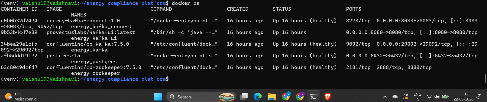

**Debezium connector status: RUNNING**
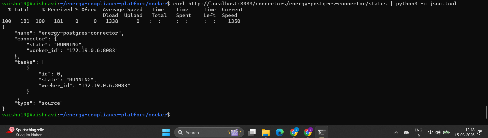

**Debezium connector plugins loaded (PostgresConnector 3.0.8.Final)**
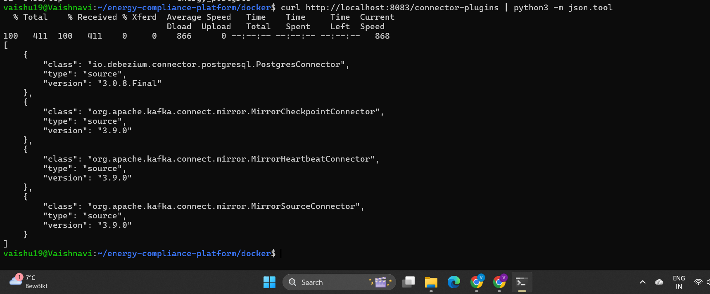

**Redpanda Cloud — cisaf.meter_readings topic with messages**
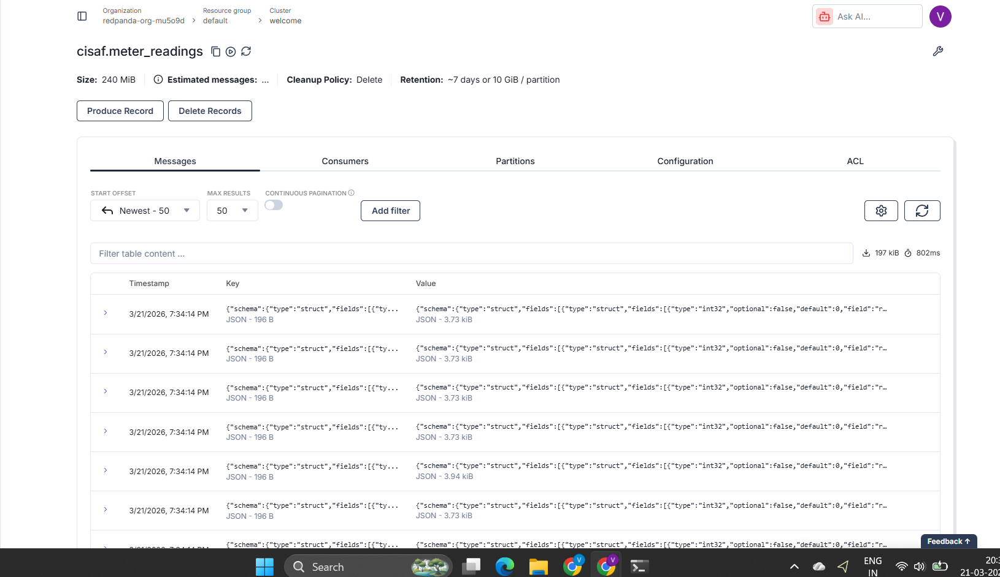

---

### Phase 3 — Gold Layer (dbt + Databricks)

**dbt lineage graph — 4 staging views → 4 gold tables**
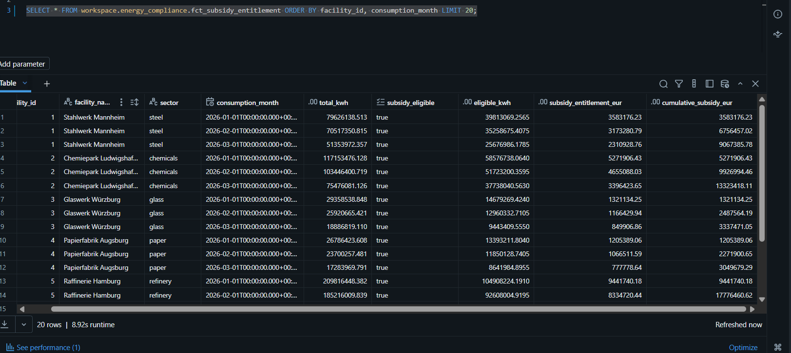

**Databricks catalog — workspace.energy_compliance schema and tables**
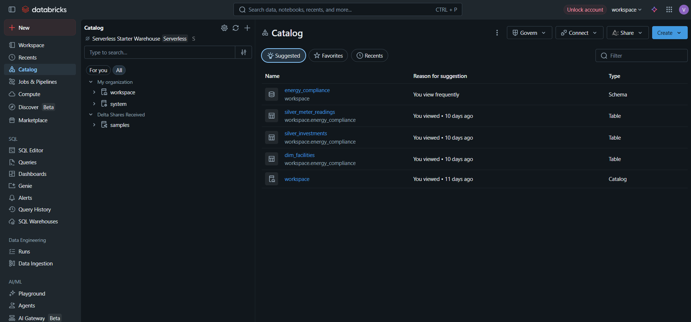

**fct_subsidy_entitlement query results on Databricks**
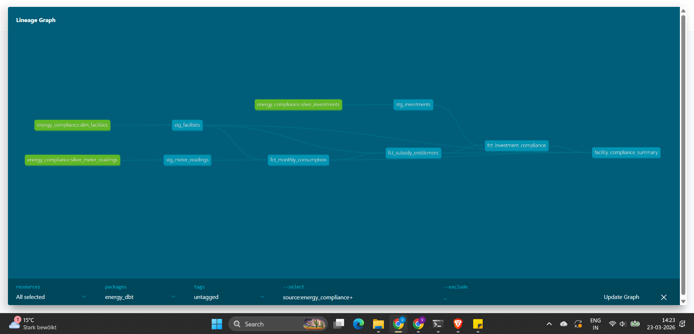

---

### Phase 4 — Airflow Orchestration

**Both DAGs active in Airflow UI**
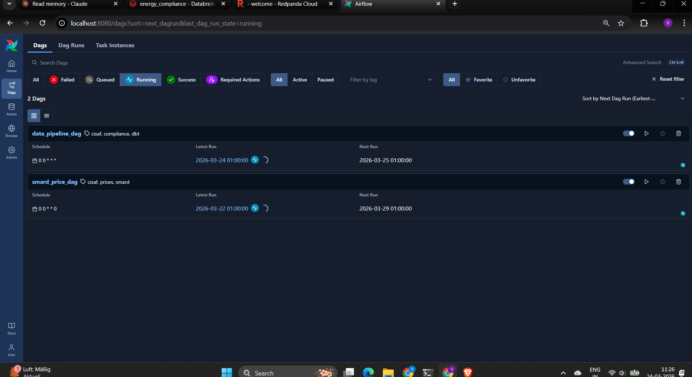

**compliance_check task log — per-facility compliance output**
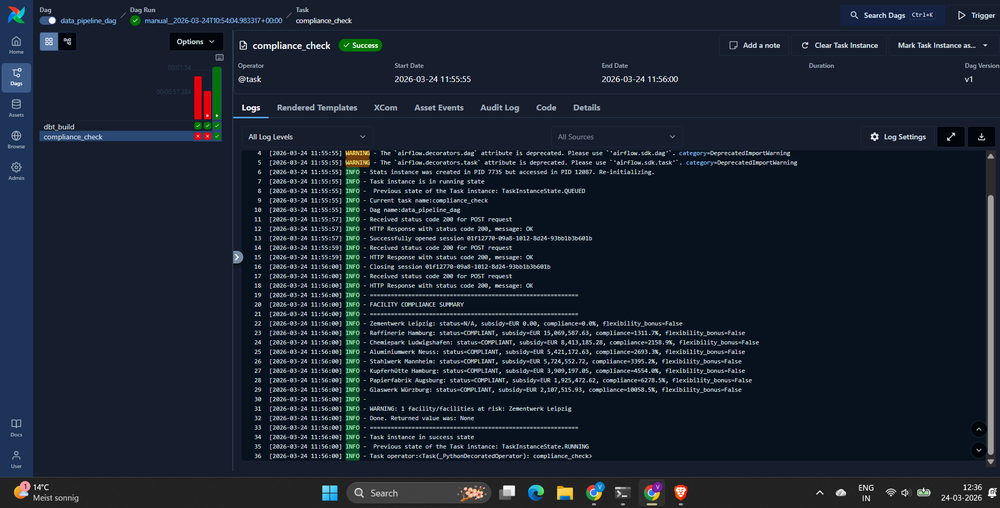

---

### Phase 5 — RAG Layer

**Query 1: What qualifies as a demand flexibility investment under CISAF?**
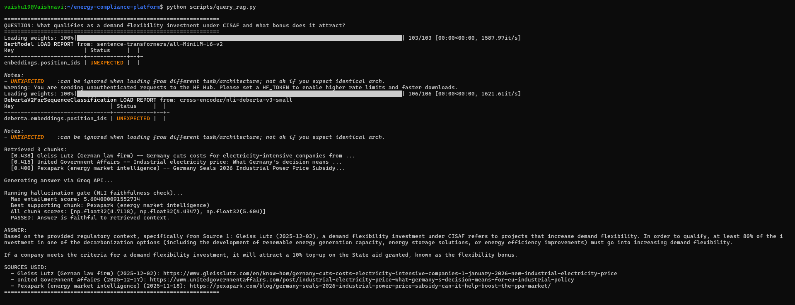

**Query 2: What is the reinvestment deadline and consequences of non-compliance?**
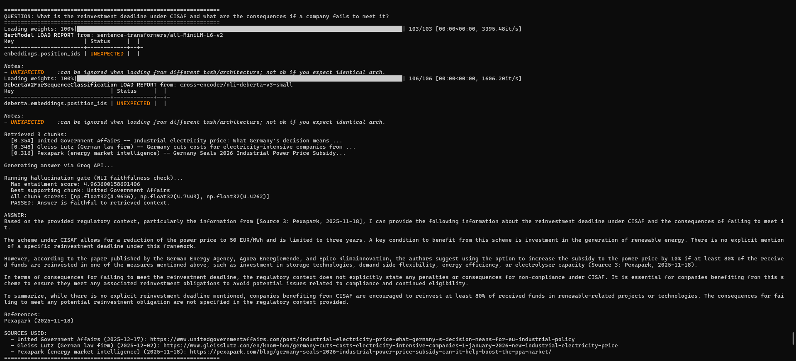

**Query 3: Which facilities are at risk? (live Databricks data + RAG context)**
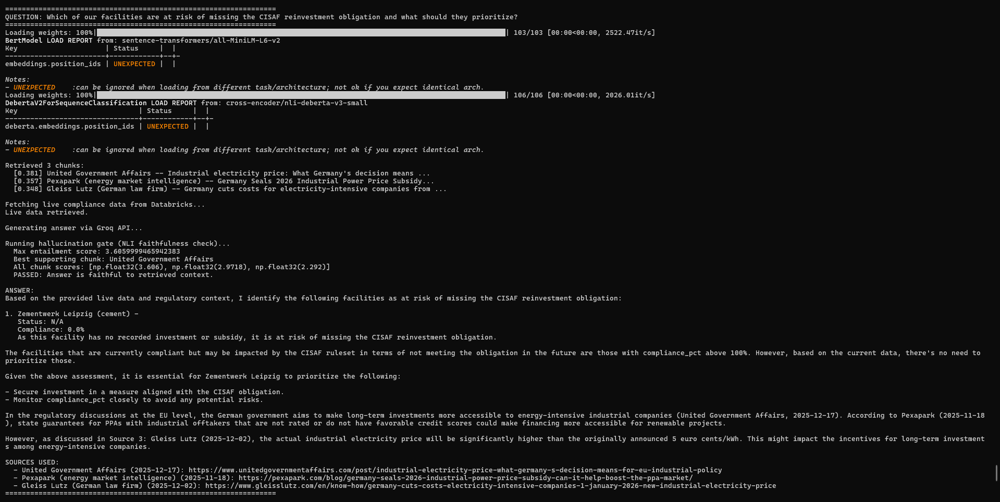
